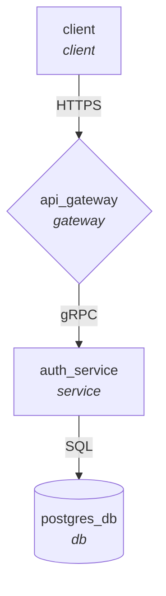

# GraphNode (`graphnode` / `gnode`)

<p align="center">
  <strong>Lightweight command-line system tree, graph architecture, and dependency mapping tool.</strong>
</p>

<p align="center">
  
  
  
  <a href="https://khokharsnehil45.github.io/graphnode/"></a>
</p>

```text
Node ──▶ [Connect] ──▶ System Tree / Graph ──▶ Visual Terminal UI & Mermaid Export
```

**GraphNode** lets you build, inspect, and document system architecture topologies, microservice networks, and dependency graphs directly from your terminal.

🌐 **Interactive Documentation Website**: [https://khokharsnehil45.github.io/graphnode/](https://khokharsnehil45.github.io/graphnode/)

---

## Single-Line Install

Install GraphNode instantly with a single command (Linux / macOS):

```bash
curl -sSL https://raw.githubusercontent.com/khokharsnehil45/graphnode/main/install.sh | bash
```

The installer configures an isolated virtual environment and creates binary links for `graphnode` and `gnode` at `~/.local/bin`.

### Manual Installation (git & pip)

```bash
git clone https://github.com/khokharsnehil45/graphnode.git
cd graphnode

# Install package
pip install .

# Or editable mode for development
pip install -e ".[dev]"
```

---

## Quick Start: Dedicated Named Graphs & Custom Commands

You can create independent system graphs and control each directly via its own auto-generated CLI command:

```bash
# 1. Create a new graph (automatically generates an executable CLI shortcut!)
graphnode -create graph1

# 2. Directly command graph1 in your terminal!
graph1 -add node1 -type service
graph1 -add node2 -type db

# 3. Connect nodes with protocol or relationship labels
graph1 -connect node1 node2 -label reads

# 4. Visualize the system tree
graph1 -show
```

---

## Standard Workflow

You can also use `graphnode` directly in any project folder:

```bash
# Add components
graphnode -add client -type client
graphnode -add api_gateway -type gateway
graphnode -add auth_service -type service
graphnode -add postgres_db -type db

# Connect components
graphnode -connect client api_gateway -label HTTPS
graphnode -connect api_gateway auth_service -label gRPC
graphnode -connect auth_service postgres_db -label SQL

# Visualize system tree
graphnode -show
```

---

## Multi-Graph Registry

Switch, list, and manage multiple system graphs effortlessly:

```bash
# List all registered graphs
graphnode -graphs

# Switch active graph
graphnode -use backend_v2

# Delete a graph and its CLI shortcut
graphnode -delete-graph old_system
```

---

## Visual Terminal Views

### 1. Hierarchy Tree View (`-show` / `-show tree`)

```text
📦 System Graph: my_app
   Nodes: 4 | Connections: 3
───────────────────────────────────────────────────────
└── 💻 [client] (client)
    └── ──(HTTPS)──▶ 🌐 [api_gateway] (gateway)
        └── ⚙️  [auth_service] (service)
            └── ──(SQL)──▶ 💾 [postgres_db] (db)
```

### 2. Architecture Card View (`-show card` / `-list`)

```text
=================================================================
|                   SYSTEM ARCHITECTURE GRAPH                   |
=================================================================
| Graph Name    : my_app                                        |
| Total Nodes   : 4                                             |
| Total Edges   : 3                                             |
| Entry Points  : client                                        |
| Sinks/Leaves  : postgres_db                                   |
| Cycles Found  : 0                                             |
=================================================================
| [api_gateway]  (gateway)                                      |
|   ──▶ Outgoing (1) : auth_service [gRPC]                      |
|   ◀── Incoming (1) : client                                   |
|---------------------------------------------------------------|
| [auth_service]  (service)                                     |
|   ──▶ Outgoing (1) : postgres_db [SQL]                        |
|   ◀── Incoming (1) : api_gateway                              |
|---------------------------------------------------------------|
| [client]  (client)                                            |
|   ──▶ Outgoing (1) : api_gateway [HTTPS]                      |
|---------------------------------------------------------------|
| [postgres_db]  (db)                                           |
|   ──▶ Outgoing : (None - Leaf)                                |
|   ◀── Incoming (1) : auth_service                             |
=================================================================
```

### 3. Direct Flow View (`-show flow`)

```text
Connections in my_app:
  api_gateway ──(gRPC)──▶ auth_service
  auth_service ──(SQL)──▶ postgres_db
  client ──(HTTPS)──▶ api_gateway
```

---

## Command Reference

| Action | Flags | Description | Example |
| :--- | :--- | :--- | :--- |
| **Add Node** | `-add`, `add` | Add one or more nodes | `graphnode -add frontend backend` |
| **Component Type** | `-type`, `-t` | Specify node role/type | `graphnode -add db -type db` |
| **Connect Nodes** | `-connect`, `connect` | Create directed connection | `graphnode -connect web api` |
| **Edge Label** | `-label` | Add protocol or relation | `graphnode -connect web api -label HTTPS` |
| **Disconnect** | `-disconnect` | Remove connection | `graphnode -disconnect web api` |
| **Remove Node** | `-remove`, `-rm` | Delete node and incident edges | `graphnode -remove old_service` |
| **Show Graph** | `-show`, `show` | Render tree, card, or flow | `graphnode -show` or `graphnode -show card` |
| **List Details** | `-list`, `list` | Show architecture breakdown | `graphnode -list` |
| **Status Metrics** | `-status`, `status` | Show graph stats & cycles | `graphnode -status` |
| **Export** | `-export` | Export to Mermaid/DOT/MD/JSON | `graphnode -export mermaid -o arch.mmd` |
| **Initialize** | `-init` | Create new `.graphnode.json` | `graphnode -init backend_v2` |
| **Clear Graph** | `-clear` | Wipe nodes and edges | `graphnode -clear` |

---

## Component Types & Icons

GraphNode formats nodes with distinctive icons:
- `client` 💻
- `gateway` 🌐
- `service` ⚙️
- `db` / `database` 💾
- `queue` / `broker` 📬
- `cache` ⚡
- `worker` 🔨
- `frontend` 🖥️
- `storage` 📦

---

## Exporting Diagrams

Export your system graph to **Mermaid** markdown for documentation:

```bash
graphnode -export mermaid
```

Outputs:


Or generate a full Markdown report:
```bash
graphnode -export markdown -o architecture.md
```

---

## Storage Model

GraphNode stores its topology in `.graphnode.json` in the project root. Like Git, it automatically detects `.graphnode.json` from subdirectories. You can also specify an exact file using `-f <path>`.

---

## License

MIT License.
