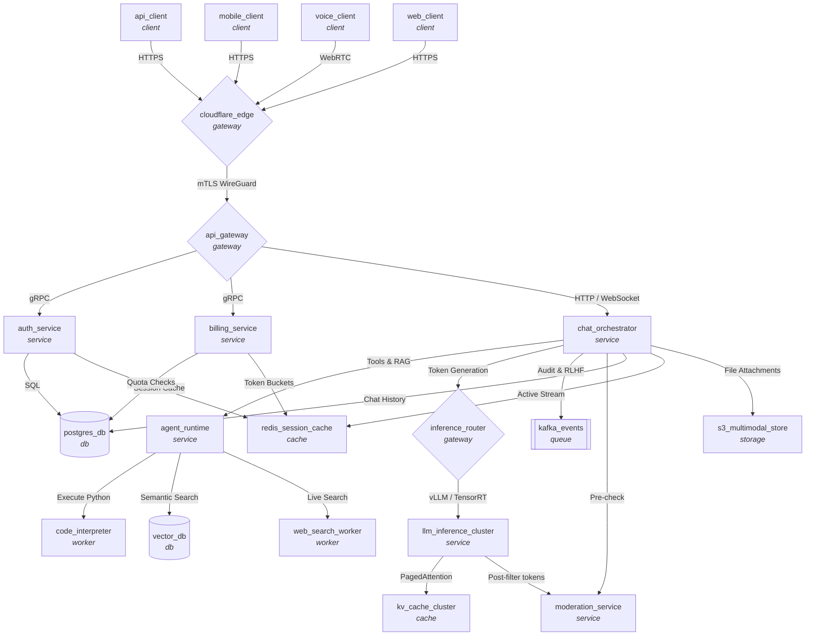

# System Architecture: chatgpt_system

## Architecture Diagram

## Components

| Name | Type | Description | In-Degree | Out-Degree |
| :--- | :--- | :--- | :---: | :---: |
| `agent_runtime` | `service` | Tool calling engine and execution orchestrator | 1 | 3 |
| `api_client` | `client` | - | 0 | 1 |
| `api_gateway` | `gateway` | Kong/Envoy API Gateway with auth routing and rate limits | 1 | 3 |
| `auth_service` | `service` | OAuth2, JWT authentication and API key validation | 1 | 2 |
| `billing_service` | `service` | Token accounting, Stripe billing, and tier quotas | 1 | 2 |
| `chat_orchestrator` | `service` | Conversation manager, prompt assembly, and SSE streaming | 1 | 7 |
| `cloudflare_edge` | `gateway` | Cloudflare WAF, DDoS protection, and SSL termination | 4 | 1 |
| `code_interpreter` | `worker` | Sandboxed Python execution environment (Firecracker/gVisor) | 1 | 0 |
| `inference_router` | `gateway` | Dynamic vLLM/TensorRT-LLM load balancer | 1 | 1 |
| `kafka_events` | `queue` | Event stream for telemetry, audit logs, and RLHF data | 1 | 0 |
| `kv_cache_cluster` | `cache` | Distributed PagedAttention KV-cache storage | 1 | 0 |
| `llm_inference_cluster` | `service` | NVIDIA H100 GPU cluster running GPT reasoning models | 1 | 2 |
| `mobile_client` | `client` | - | 0 | 1 |
| `moderation_service` | `service` | Real-time safety guardrails and content classification | 2 | 0 |
| `postgres_db` | `db` | Relational chat logs, users, organizations | 3 | 0 |
| `redis_session_cache` | `cache` | Active session cache and token bucket rate limits | 3 | 0 |
| `s3_multimodal_store` | `storage` | User uploads, voice clips, and generated images | 1 | 0 |
| `vector_db` | `db` | Qdrant / Milvus vector search for Custom GPTs and RAG | 1 | 0 |
| `voice_client` | `client` | - | 0 | 1 |
| `web_client` | `client` | - | 0 | 1 |
| `web_search_worker` | `worker` | Live web browsing and document scraping worker | 1 | 0 |

## Connections

| Source | Protocol / Relation | Target |
| :--- | :--- | :--- |
| `agent_runtime` | `Execute Python` | `code_interpreter` |
| `agent_runtime` | `Semantic Search` | `vector_db` |
| `agent_runtime` | `Live Search` | `web_search_worker` |
| `api_client` | `HTTPS` | `cloudflare_edge` |
| `api_gateway` | `gRPC` | `auth_service` |
| `api_gateway` | `gRPC` | `billing_service` |
| `api_gateway` | `HTTP / WebSocket` | `chat_orchestrator` |
| `auth_service` | `SQL` | `postgres_db` |
| `auth_service` | `Session Cache` | `redis_session_cache` |
| `billing_service` | `Quota Checks` | `postgres_db` |
| `billing_service` | `Token Buckets` | `redis_session_cache` |
| `chat_orchestrator` | `Tools & RAG` | `agent_runtime` |
| `chat_orchestrator` | `Token Generation` | `inference_router` |
| `chat_orchestrator` | `Audit & RLHF` | `kafka_events` |
| `chat_orchestrator` | `Pre-check` | `moderation_service` |
| `chat_orchestrator` | `Chat History` | `postgres_db` |
| `chat_orchestrator` | `Active Stream` | `redis_session_cache` |
| `chat_orchestrator` | `File Attachments` | `s3_multimodal_store` |
| `cloudflare_edge` | `mTLS WireGuard` | `api_gateway` |
| `inference_router` | `vLLM / TensorRT` | `llm_inference_cluster` |
| `llm_inference_cluster` | `PagedAttention` | `kv_cache_cluster` |
| `llm_inference_cluster` | `Post-filter tokens` | `moderation_service` |
| `mobile_client` | `HTTPS` | `cloudflare_edge` |
| `voice_client` | `WebRTC` | `cloudflare_edge` |
| `web_client` | `HTTPS` | `cloudflare_edge` |
